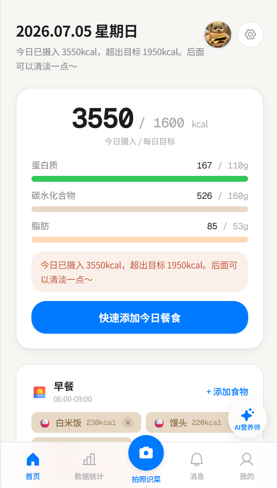
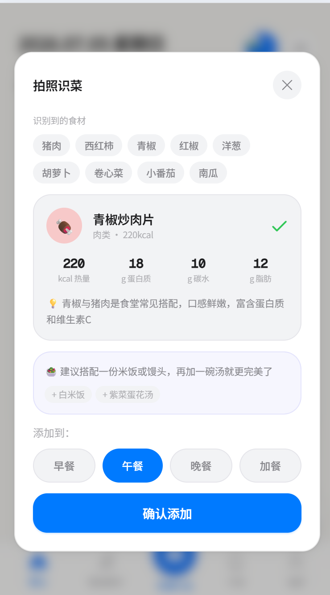
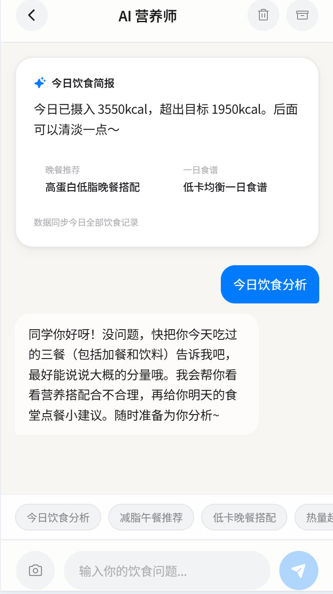

# 🥗 食愈校园 — 你的 AI 食堂搭子

> *"今天吃什么？够不够营养？会不会长胖？"——让 AI 替你操心。*

[](LICENSE)
[](https://react.dev)
[](https://python.org)

## 这是什么

**食愈校园**是一个专为大学生打造的 AI 饮食助手。

拍一张食堂饭菜的照片，AI 自动识别食材、推荐搭配菜品、估算营养成分，还能告诉你"这顿还缺点什么"。就像一个坐在你旁边的营养师朋友——我们叫她 **小愈**。

## 为什么做这个

大学生吃饭的三大痛点：

- 😵 **选择困难**：食堂几十个窗口，不知道吃什么
- 📉 **营养盲区**：碳水爆表、蛋白不够，吃了一学期才发现问题
- 💪 **健身需求**：想增肌减脂，但不会算热量和宏量营养素

食愈校园用 AI 视觉识别 + 营养知识库，把这些问题一键解决。

## ✨ 核心亮点

| 功能 | 说明 |
|------|------|
| 📷 **拍照识菜** | 拍食材 → AI 推荐成品菜（如鸡蛋+西红柿 → 西红柿炒鸡蛋）→ 给营养数据 → 搭配建议 |
| 🤖 **小愈对话** | AI 营养师随时聊，懂你的口味偏好和健康目标 |
| 📊 **营养环** | 环形图 + 进度条，热量/蛋白/碳水/脂肪一目了然 |
| 🍽️ **餐盘管理** | 早/午/晚/加餐分别记录，自由增删 |
| 👤 **个人档案** | 身高体重、营养目标、头像昵称，全部可定制 |
| 🏆 **排行榜**（规划中） | 和同学比拼饮食健康分 |
| 📅 **周报**（规划中） | AI 每周生成饮食总结和改进建议 |

## 📸 界面预览

| 首页 | 拍照识菜 | AI 对话 |
|:---:|:---:|:---:|
|  |  |  |
| 营养环 + 餐次卡片 | 食材识别 + 菜品推荐 + 搭配建议 | 小愈 AI 营养师实时对话 |

## 🛠️ 技术栈

### 前端
- React 19 + Vite 8
- Tailwind CSS 4 + 液态玻璃设计系统
- Zustand 状态管理
- Framer Motion 动画
- Phosphor Icons

### 后端
- Python 3.11+ / FastAPI
- PostgreSQL + Redis + RabbitMQ
- SQLAlchemy 2.0 异步 ORM
- Qwen-VL 视觉识别
- JWT 鉴权
- Docker 部署

## 📁 项目结构

```
food-healing/
├── frontend-v2/       # React 前端
│   ├── src/
│   │   ├── components/   # UI 组件
│   │   ├── stores/       # Zustand 状态
│   │   ├── hooks/        # 自定义 Hook
│   │   ├── lib/          # API / 工具函数
│   │   └── data/         # 食物数据
│   └── vite.config.js
├── backend/           # FastAPI 后端
│   ├── app/
│   │   ├── routes/       # API 路由
│   │   ├── services/     # 业务逻辑
│   │   ├── models/       # ORM + Pydantic
│   │   └── utils/        # 工具函数
│   ├── Dockerfile
│   └── pyproject.toml
└── docs/              # 设计文档
```

## 🚀 快速开始

### 前端
```bash
cd frontend-v2
npm install
npm run dev
```

### 后端
```bash
cd backend
cp .env.example .env   # 编辑 .env 填入 API Key
uv sync
uv run uvicorn app.main:app --reload
```

### Docker
```bash
cd backend
docker build -t food-healing-backend .
docker run -d -p 8000:8000 --env-file .env food-healing-backend
```

## 📄 许可证

MIT License — 详见 [LICENSE](LICENSE)
